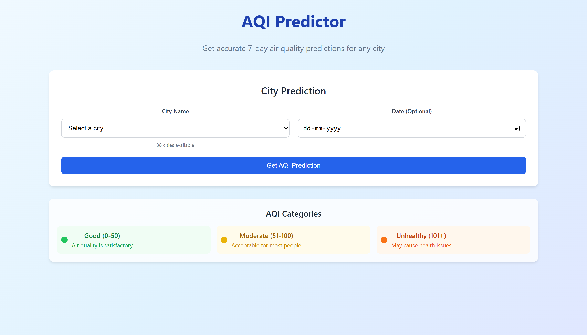
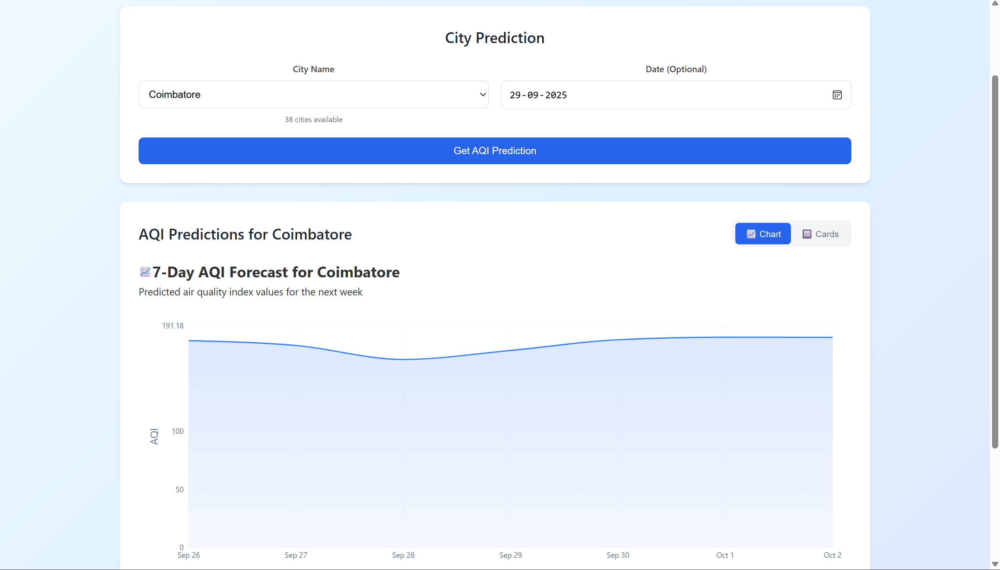
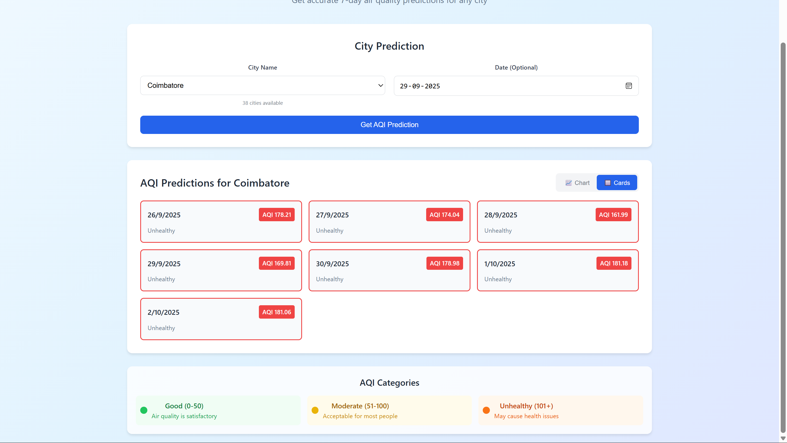

# ✈ Flight Fare Prediction Project

## 📄 Abstract

Air Quality Index (AQI) Prediction Model 🌫
This repository presents a daily forecasting model designed for predicting the Air Quality Index (AQI) for a specific region. Leveraging historical air quality data, meteorological parameters, and potentially other relevant features (e.g., traffic data, industrial activity), this project aims to provide accurate and timely forecasts of air pollution levels. The core of this prediction system is built upon Facebook's Prophet forecasting model, an additive regression model ideal for time series analysis with strong seasonal components and holidays. The primary goal is to develop a robust and generalizable prediction tool that can support public health advisories, environmental monitoring, and urban planning by providing insights into future air quality conditions. The project features a frontend deployed on Vercel for user interaction and visualization, while the backend API and prediction service are hosted on Render. This repository includes code for data preprocessing, model training, evaluation, and deployment considerations, making it a comprehensive resource for understanding and replicating AQI prediction efforts using the Prophet model.

## 📁 Dataset
Dataset is located in: [here](content/data.csv)

## 🔧 Tech Stack
- Python (Flask)
- React + Vite
- Tailwind CSS
- Facebook Prophet, pandas, joblib
- Hosted on: Render (backend) & Vercel (frontend)

## 🔗 Backend Repository
👉 [Visit Backend Repository](backend)

## 🔗 Frontend Repository
👉 [Visit Backend Repository](frontend)

## 🌐 Live Website
👉 [Visit](https://aqi-prediction-future-three.vercel.app/)

## 📸 Screenshots

### Homepage

### Prediction Page

### Result Page

## Model Training

The machine learning model for this project was trained and evaluated in a Google Colab notebook. You can view the complete data analysis, model training, and evaluation process here:

**[Python Notebook link Link](content/ProjectAQI.ipynb)**

## Created By

Rohit Kumar J, Shihas S, Sidharth Chand Manoj , Sidharth C N

